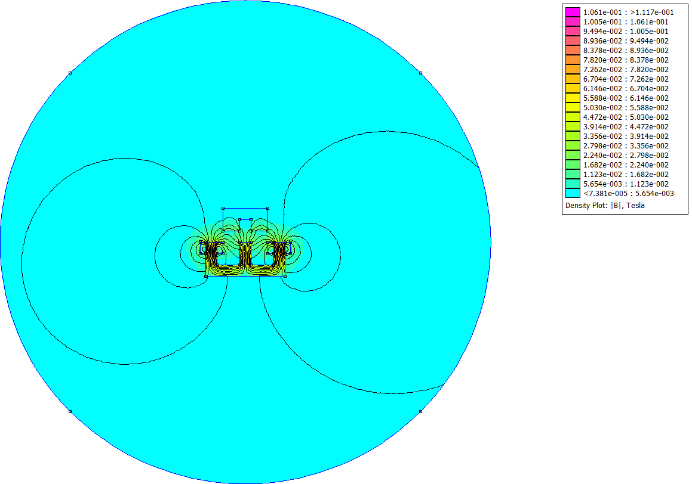
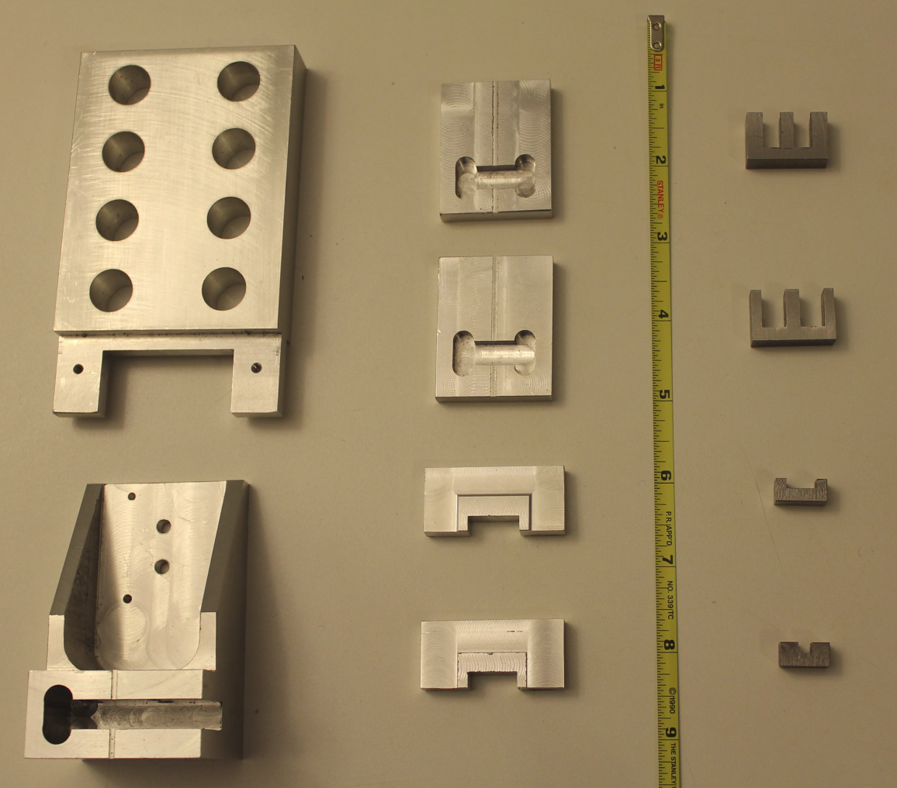
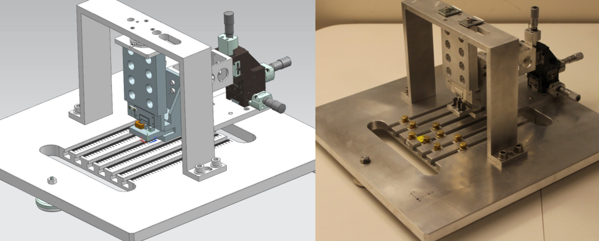

#### [←home](../README.md)

Some of my interesting academic projects. 
 
+ [Rayleigh–Bénard Convection - 2D - CFD](#Section1)
+ [Ramjet Engine Sizing - Analytical](#Section2)
+ [Linear Variable Reluctance Motor - Desing Optimization](#Section3)
+ [Vortex Shedding Frequency for Circular and Square Cylinders - 2D - CFD](#Section4)
 
---
 
## <a name="section1"><a/>Rayleigh–Bénard Convection - 2D - CFD

CFD code solving the Rayleigh–Bénard Convection problem by full 2D implementation through Matlab. 

### Implementation Highlights
 
| Topic | Comments |
| ------ | ----------- |
| Programming    |  Matlab  |
| Governing PDEs    |  Non-dimensional Form   |
| Imcompressibility   | Satisfied via Poisson equation |
| Poisson equation  | Fourier Transform solution |
| BCs | Periodic |
| Grid  | Staggered |
| Time Integration    |  Fractional Step Method via Runge–Kutta  |
| Stability    |  Max between Convection-Diffusion stability Limit (CFL)  |

### Domain

 
### Solution 
 
Grid=64^2, Ra=10^6 ,Pr=1,T_end=0.005s
 

 
---
 
## <a name="section2"><a/>Ramjet Engine Sizing - Analytical

In aerospace applications Ramjets are used in mechanisms that require supersonic flow, such as to propel short range rockets. It uses its own speed to generate the compression necessary to decelerate the flow and produce thrust through added heat in the combustion chamber and further expansion through the nozzle.
For this type of device, the engine needs to be started via another vehicle travelling at supersonic speeds or by means of high pressure chambers in a testing setting.

 
### Engine Parameters 
 
* Ramjet engine at Mach 4, 2000 lbf/ft^2 of pressure and temperature of 519 R
* Combustion chamber Mach number <= 0.25
* Engine powered by JP10 fuel (heating value of 18,900 BTU/lbm) 
* Stoichiometric air-fuel ratio of 0.0704
* Engine Envelope: Total Length < 215”, width < 20”, throat-to-throat distance = 72” 
* Off-design analysis: Mach 2 and Mach 3

### Compressible Flow Analytical Approach
 
| Topic | Comments |
| ------ | ----------- |
| Quasi 1-D Flow |Cross-section area and thermodynamic variables: f(x)|
| Isentropic Flow    |  Facilitates use of Isentropic flow tables  |
| Normal Shock Theory   | Normal shock at diffuser throat  |
| Oblique Shock Theory| Diffuser optimization, oblique shock waves |
| Method of Characteristics  |  To determine nozzle shape  |
| Rayleigh Flow equations    |  Heat addition in combustor |

### Method of Characteristics Example

 

### Results

 

|FLOW # | MACH | P | T | P0 | T0 |
| :---: | :---: | :---: | :---: | :---: | :---: |
|1|4.0|2000.0|513.2|303670.4|2155.3|
|2|2.60|10368.9|926.7|204027.7|2171.1|
|3|1.72|34144.5|1366.2|173890.5|2175.3|
|4|0.63|132521.3|2012.8|173890.5|2175.3|
|5|0.25|166491.7|2148.4|173890.5|2175.3|
|6|0.60|120520.0|6463.0|153604.5|6926.8|
|7|1.00|81146.1|5772.3|153603.9|6926.8|
|8|3.50|2000.0|2003.8|153603.9|6926.8|
 

 
---
 
## <a name="section3"><a/>Linear Variable Reluctance Motor - Desing Optimization  

My senior desing project at UConn (2011/2012). It involved the analysis and validation of a Linear Variable Reluctance Motor. 
The task scope involved: mathematical derivation of a simplified configuration, magnetic modeling with [FEMM](https://www.femm.info/wiki/HomePage) and [Faraday](https://www.integratedsoft.com/products/Faraday) optimization, testing fixtures manufacturing (CNC machining) and final report to the client. 3 students and 2 semesters.

### Basic Configuration

### Simulation

[FEMM](https://www.femm.info/wiki/HomePage): 2D Opensource software (Finite Element Method Magnetics).
 

[Faraday](https://www.integratedsoft.com/products/Faraday): 3D time-harmonic eddy current field solver.
 

### Machining

Over 100+ hours of precision manufacturing at UConn. A great hands-on experience and very useful knowledge torward design and manufacturing.
 

### Testing
 

 
### Validation

---
 
## <a name="section4"><a/>Vortex Shedding Frequency for Circular and Square Cylinders - 2D - CFD

Vortex shedding plays an important role in flow measurement since is provides a high degree of accuracy, even in slow flow conditions with minimal disruption to the flow.  The study will compared two types of blunt bodies, circular and square shapes.

 
 
 

