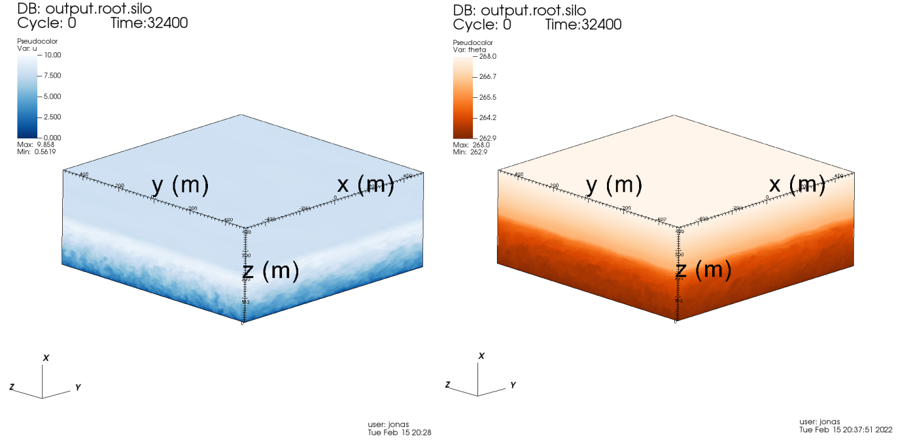
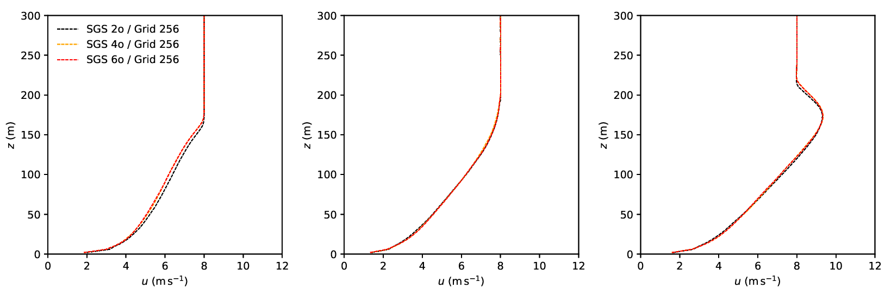

#### [←home](../README.md)

I am currently investigating the performance of LES with Smagorinsky-type subgrid-scale (SGS) clousures and its application to atmospheric boundary layer problems.

## Publications

"Effects of Discretization of Smagorinsky–Lilly Subgrid Scale Model on Large-Eddy Simulation of Stable Boundary Layers"(2025). 

[doi.org/10.3390/atmos16030310](https://doi.org/10.3390/atmos16030310/)
        
## Sample Work

## Twitter

<blockquote class="twitter-tweet">
More worms on a vertical plane! Stable boundary layers typically form at night when the ground is colder than the atmosphere. The warm over cold arrangement confines turbulence near the ground. Simulation by Jonas Banhos, a graduate student in our group. <a href="https://twitter.com/hashtag/ArtScience?src=hash&amp;ref_src=twsrc%5Etfw">#ArtScience</a> <a href="https://t.co/rNK5Oga8oi">pic.twitter.com/rNK5Oga8oi</a>
&mdash; Computational Fluid Dynamics group (@me3250) <a href="https://twitter.com/me3250/status/1413502263889301507?ref_src=twsrc%5Etfw">July 9, 2021</a></blockquote>  
