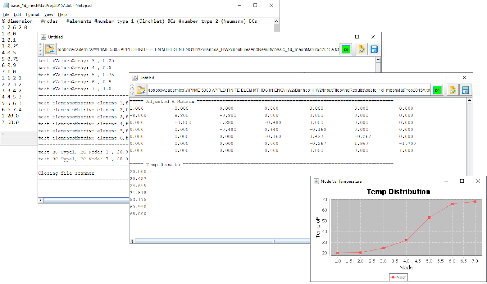
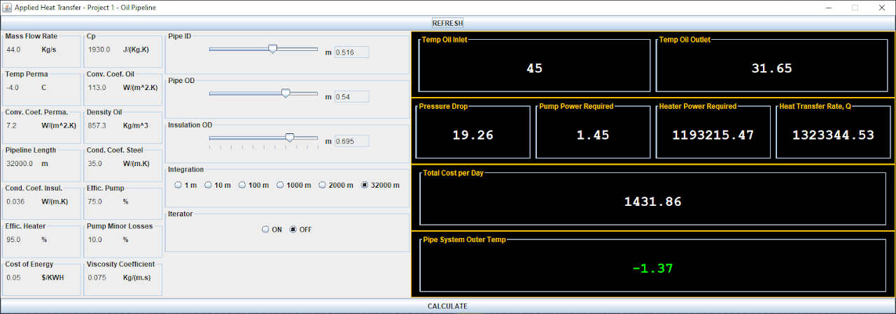
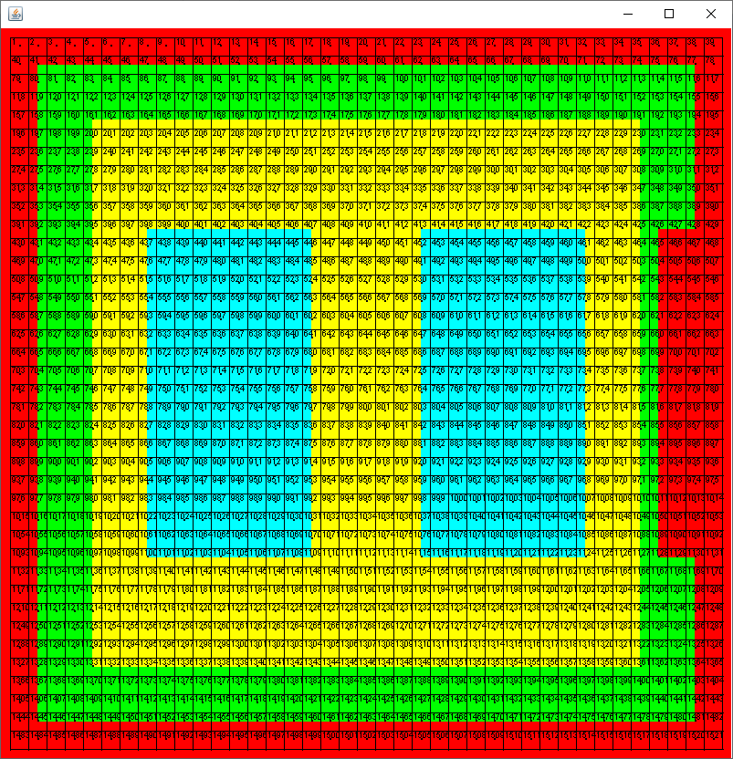
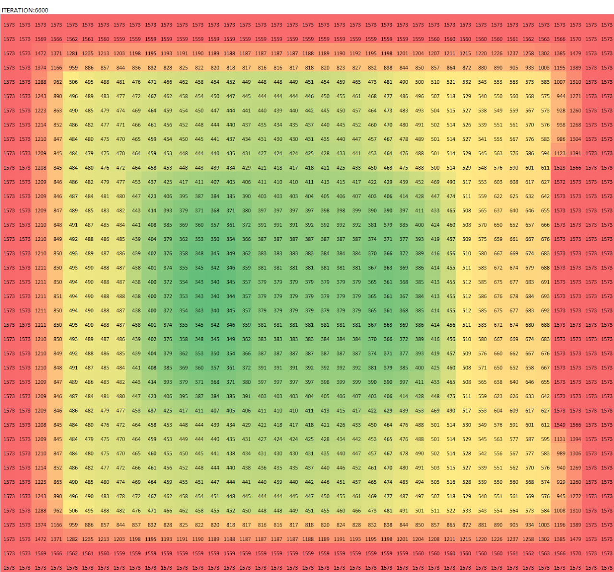
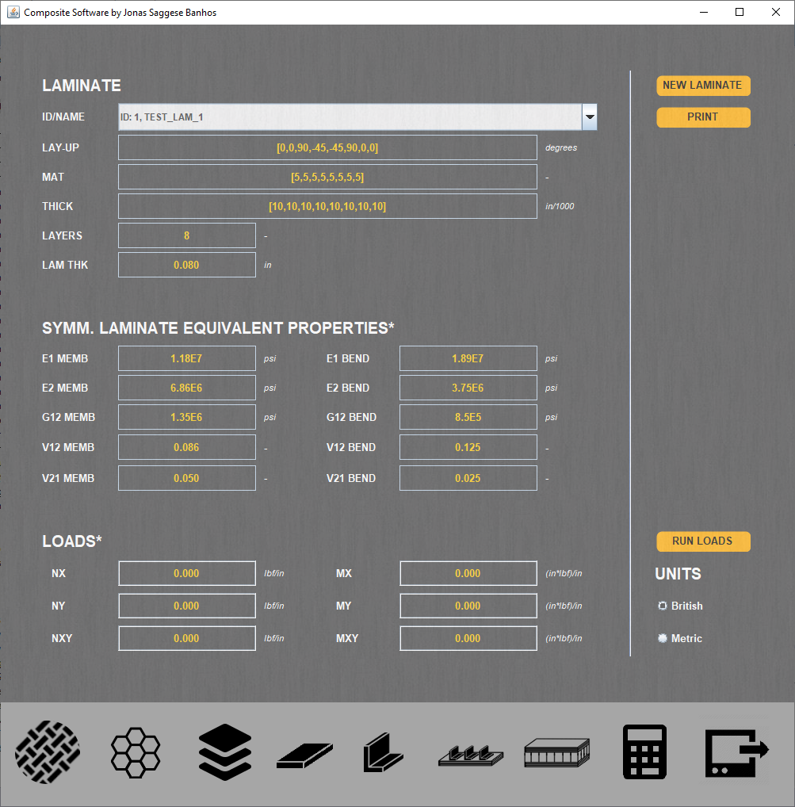
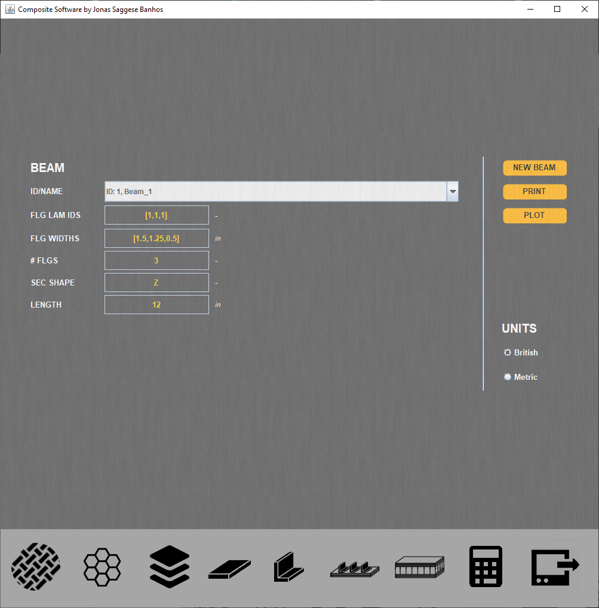
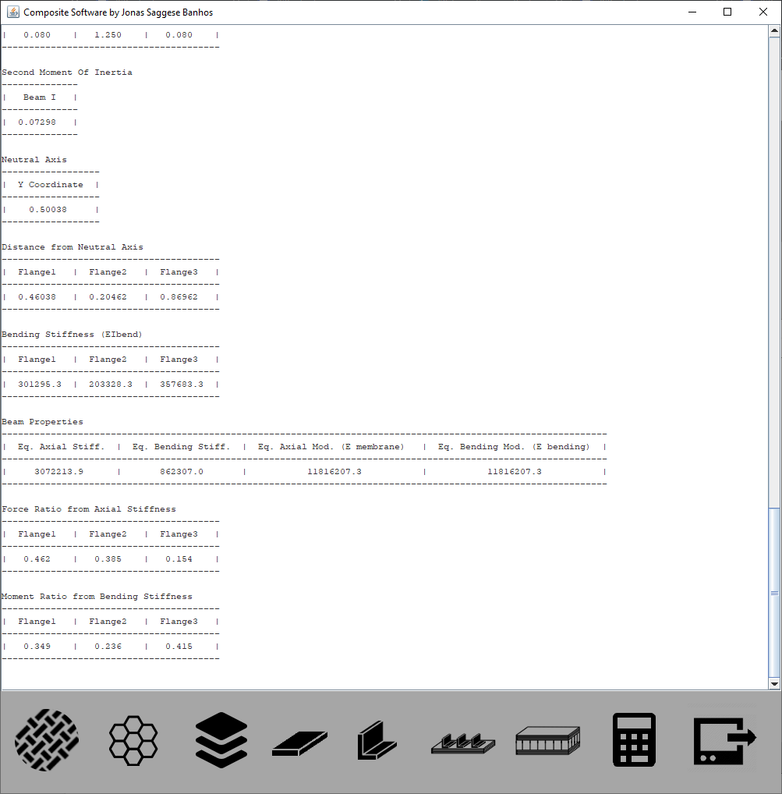
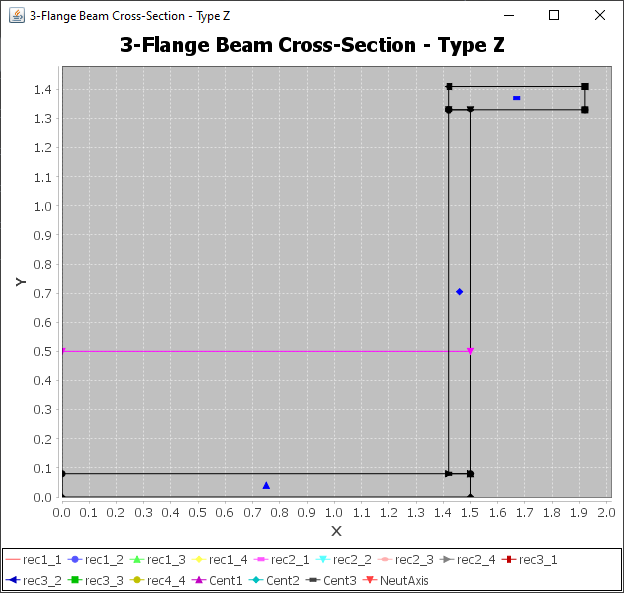

#### [home](../README.md)

 Through my academic carrerr I have decided to build a few simple programs either in school/home to help me understand a little better the physics and programming itself. 
 
 
 
+ [Finite Element Method - Fin Equation - JAVA Application](#Section1)
+ [Pipeline - JAVA Application](#Section2)
+ [Steal Beam - Cross-Section - Fire/Insulation Damage - Transient Analysis - JAVA Application](#Section3)
+ [Composite Software - JAVA Application](#Section4)

## <a name="section1"><a/>Finite Element Method - Fin Equation - JAVA Application
FEM implementation for the fin equation. From the Applied Finite Element Methods class at WPI in 2015. The project included the full derivation of the FEM formulation and software design document with pseudo code. The stand-alone software can read a user input file, display the information on output window, perform iterations and display results. User is able to save results to file. JFreeChart library was used to provide plotting capabilities. 

 
---

## <a name="section2"><a/>Pipeline - JAVA Application

A model of a pipeline, involving the transport of oil and permafrost. The problem was proposed in my applied Adv. Heat Transfer Class in 2014.  The goal was to provide a stand-alone tool that can display flow input and output parameters, as well as varying pipe and insulation diameters. It used integration and closed formulas to attain solution.

 
---

## <a name="section3"><a/>Steal Beam - Cross-Section - Fire/Insulation Damage - Transient Analysis - JAVA Application

Another Adv. Heat Transfer problem in 2014. The goal was to investigate the effects of thermal insulation damage on a steel beam under fire. It uses Finite Volume Method (FVM) on a uniform grid to obtain the transient solution. Overall it is a simple implementation where every cell has its own numerical scheme (boundary, corner, solid, etc). Again I took the opportunity to practice Java. The user can define material zones via vertices and assign specific ids to those. Object oriented programing was needed where the domain is made up of "rectangles" containing properties. The program displays node id and color-coded areas. There s no file user inputs where they are specified directly in the Java code. Note that a .csv file is created containing thermal results. They can be plotted in Excel. Ideally, values could have been plotted directly in the JFrame. Again, future implementation needed here. For now, good practice.

 

 

 

---
 
## <a name="section4"><a/>Composite Software - JAVA Application
A more complex Java program and hence a true "work-in-progress" project.  I had the idea of building the program while taking the Composite Design class at UConn in 2018.  We used a great book, Design and Analysis of Composite Structures, 2nd Edition. Hence I decided to step-up the game and try to transform most of the book into a true composites software. My original goal was to master Composite Laminate Theory (CLT) and dive deep into closed-form solutions for various composite components (laminates, plates, beams, panels, sandwiches) under various loads (tension, compression, bending, shear) given various failure theories. Again by building it in Java I wanted to create something useful and easy to use. For example, user can build a laminate, use it to create a plate and have various plates to build a beam. User can inspect output window and plot a variety of results. I started this project in 2018 (first quarter) and I am not sure when it will be done, given that in the last few years I have only worked a few days on it. Regardless I am showcasing it here. 

 

 

 

